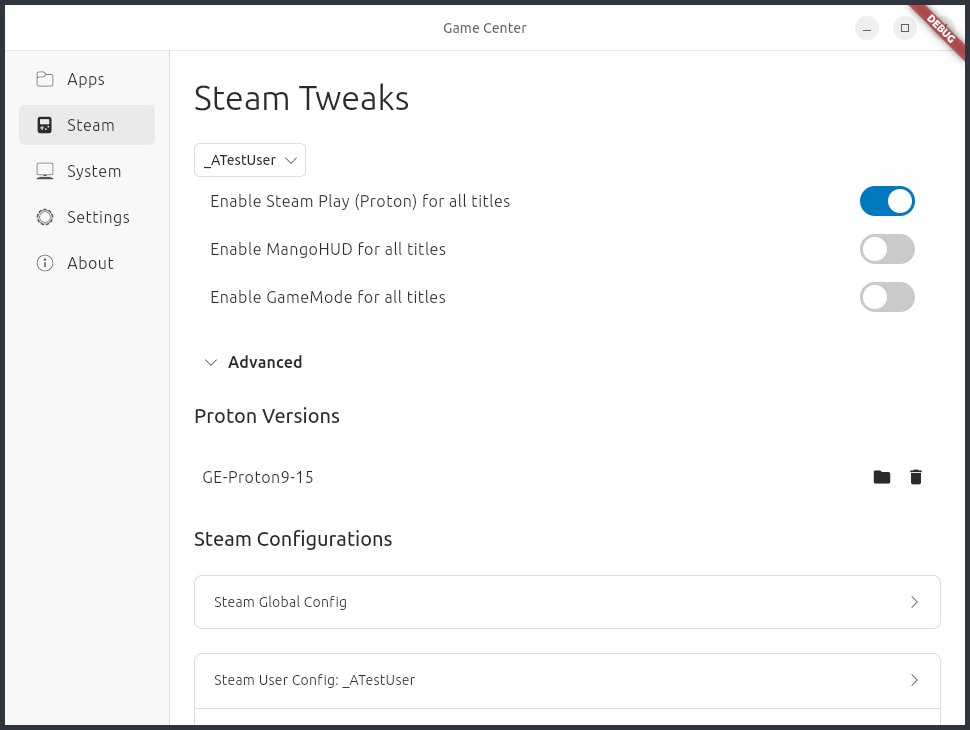

# Game Center

Flutter app for system and game tweaks and information.



*Work in progress*

## Development

*At the moment, this app requires you to have the Steam snap installed and
opened at least once.*

1. Install [Flutter](https://docs.flutter.dev/get-started/install/linux/desktop)
and [Melos](https://melos.invertase.dev/~melos-latest/getting-started)
    - This repository uses [FVM](https://fvm.app/) for maintaining Flutter versions
2. Bootstrap the monorepo
    ```
    melos bootstrap
    ```
3. Generate models
    ```
    melos generate
    ```
3. Run the app
    ```
    cd packages/game_center
    flutter run
    ```
